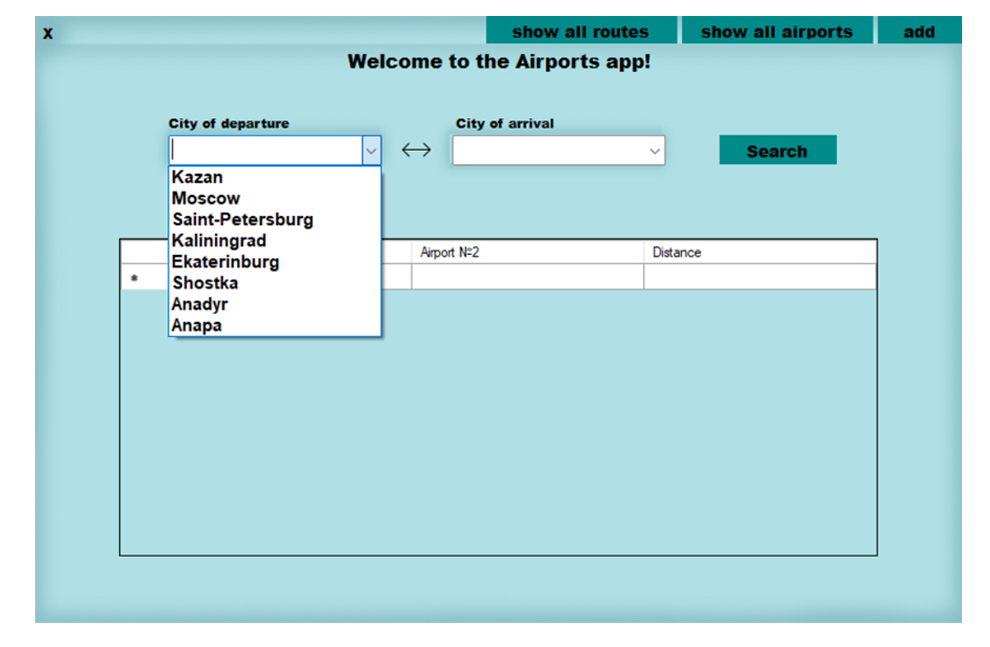
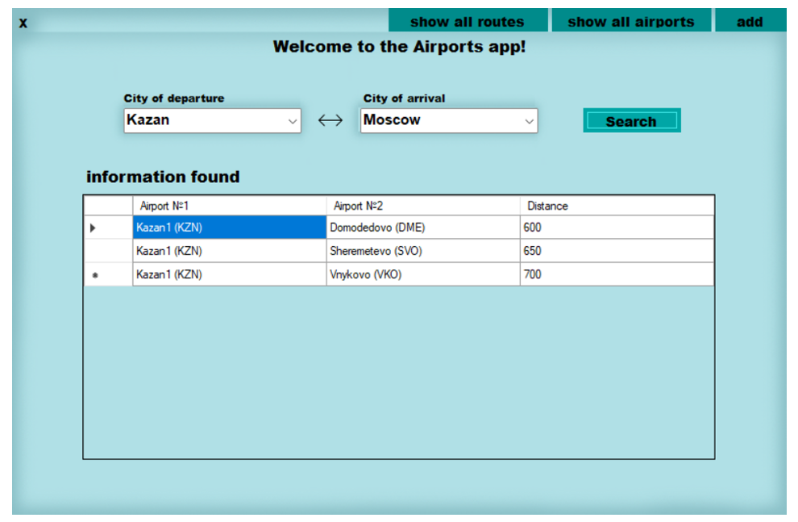
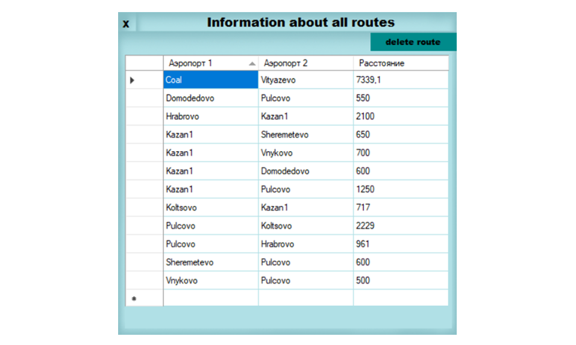

# course_paper
> Приложение написано на C#, используется фреймфорк .NET Windows Forms App

## Table of contents

1. [Main Form](#main-form)
2. [Information output form](#information-output-form)
3. [Form for adding data](#form-for-adding-data)
4. [About classes](#about-classes)
5. [Form with information about routes](#form-with-information-about-routes)

## Main Form
#### Это главная форма, на ней расположены 2 textBox'a (город отправления и город прибытия), в которые нужно вводить город.
 
код формы 1 находится [здесь](coursWork/coursWork/Form1.cs)

#### Если один из городов не найден, но выведется соответствующее сообщение в информирующем окне. Если оба города уже есть в базе, но не найден ни один маршрут из одного города в другой, то тоже выведется соответствующее сообщение.
 

#### Если оба города нашлись и в базе есть информация о маршрутах из одного города в другой (с учетом всех аэропортов в городе), то выводятся названия аэропортов и расстояние.
 

## Information output form
#### Эта форма открывается при нажатии на кномпу "show" (на главной форме в правом верхнем углу). 
#### При открытии формы сразу выводятся все данные (о существующих аэропортах, городах), имеющие в базе (в файле). Если файл пуст, то не выведется ничего.
 
код формы 1 находится [здесь](coursWork/coursWork/FormShow.cs)

## Form for adding data
#### Это форма для добавления новых данных в бд (файл). Заправшиваются данные о названии аэропорта (например Пулково), короткое имя / код (Например LED), город (например Санкт-Петербург). Добавляются 2 города и расстояние между ними. Также при нажатии на кнопку "Delete all" удалится вся информация из файлов с предварительным подтверждением этого действия. 
#### Ниже кнопка-текст, при нажатии на которую выводится окно со всеми маршрутами.
- Если один из городов уже существует, то он не будет перезаписан заново, добавится информация о втором городе и расстояние между ними. 
- Если обоих городов нет, то занесется информация о каждом городе и добавится дистанция между ними.
 
код формы 1 находится [здесь](coursWork/coursWork/FormAdd.cs)

## Form with information about routes
#### Это окно с выводом всех маршрутов, открывается из формы добавления. Имеется возможность удалять маршруты, выбрав нужный. После удаления, на главной форме указанный маршрут не будет найден.
 
код формы 1 находится [здесь](coursWork/coursWork/ShowRoutes.cs)

## About classes
#### Созданы 3 класса 
- [Airport](coursWork/coursWork/Airport.cs) - хранит в себе данные об аэропортах;
- [Distance](coursWork/coursWork/Distance.cs) - хранит в себе данные о дистанциях;
- [DataBase](coursWork/coursWork/DataBase.cs) - является связывающим звеном между формами, классами (Airport, Distance) и текстовым файлом.
